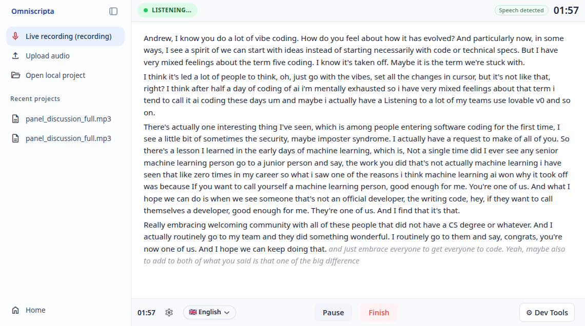
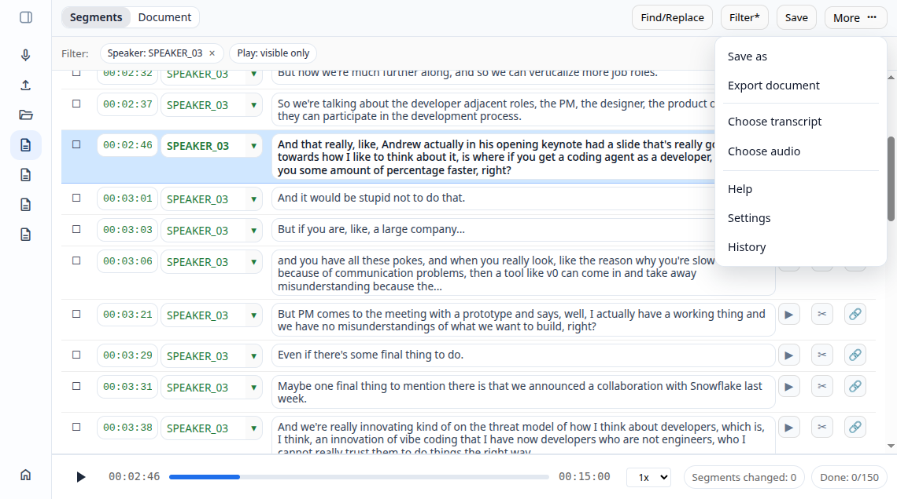
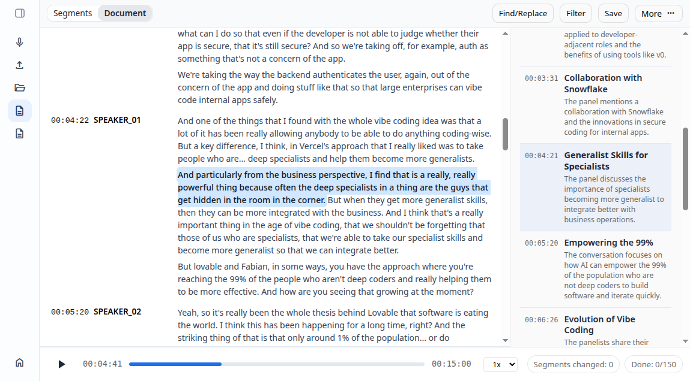

# Omniscripta

`omniscripta` is the portal application for live and file-based transcription
workflows.

It provides the FastAPI backend, API routes, static application shell, upload
coordination, live recording session management, and operational scripts that
tie together the separate ASR, LLM, worker, and frontend pieces of the
Omniscripta stack.



## Index

- [What It Does](#what-it-does)
- [Repository Role](#repository-role)
- [Related Repositories](#related-repositories)
- [Code Map](#code-map)
- [API Surface](#api-surface)
- [Runtime Model](#runtime-model)
- [Configuration](#configuration)
- [Local Development](#local-development)
- [Tests](#tests)
- [Deployment Notes](#deployment-notes)
- [Screenshots](#screenshots)

## What It Does

- serves the Omniscripta portal API with FastAPI
- serves a checked-in static frontend shell for the current app UI
- manages live recording sessions over WebSocket
- feeds live audio into the reusable `realtime-asr-engine` package
- submits live ASR work to `asr-pool` through `asr-pool-api`
- accepts uploaded audio files and creates file-backed upload jobs
- performs upload-side snipping, progress prediction, and topic generation
- hands ASR work to the standalone `asr-worker` / `asr-pool` path
- sends topic-generation prompts to `llm-pool`
- exposes health, ops, config, and artifact endpoints for the app UI
- includes dev and prod systemd/deployment helpers

## Repository Role

This repo is the application integration layer. It is not a standalone ASR
engine, LLM server, worker daemon, or frontend source repository.

The backend code lives under `app/`. The tracked `static/` directory contains a
deployable frontend build and demo fixtures, while the editable frontend source
lives outside this repository in
[`Bobcat/omniscripta-ui`](https://github.com/Bobcat/omniscripta-ui). That
frontend repo uses `spa-foundation` for the SPA shell primitives.

The main application entrypoint is `app/main.py`. It creates the FastAPI app,
mounts the system, live, and upload routers, and starts the upload batch
coordinator on application startup.

## Related Repositories

Omniscripta is split across focused repositories:

| Repository | Role |
| --- | --- |
| [`Bobcat/omniscripta-ui`](https://github.com/Bobcat/omniscripta-ui) | Frontend source repo for the Omniscripta application UI. It builds into this repo's `static/` directory for deployment. |
| [`Bobcat/asr-pool`](https://github.com/Bobcat/asr-pool) | FastAPI ASR pool with warm WhisperX runner slots, request scheduling, completions, and artifact endpoints. |
| [`Bobcat/asr-pool-api`](https://github.com/Bobcat/asr-pool-api) | Typed Python client for submitting ASR work, reading status, consuming completions, and downloading SRT artifacts. |
| [`Bobcat/asr-worker`](https://github.com/Bobcat/asr-worker) | File-backed worker daemon that processes upload jobs on top of `asr-pool`. |
| [`Bobcat/llm-pool`](https://github.com/Bobcat/llm-pool) | FastAPI LLM inference pool used for topic generation and other local LLM tasks. |
| [`Bobcat/realtime-asr-engine`](https://github.com/Bobcat/realtime-asr-engine) | Reusable engine for live audio ingest, rolling ASR scheduling, and transcript state. |
| [`Bobcat/realtime-translation-engine`](https://github.com/Bobcat/realtime-translation-engine) | Reusable event-driven engine for incremental translation workflows. |
| [`Bobcat/spa-foundation`](https://github.com/Bobcat/spa-foundation) | Lightweight JavaScript foundation package used by `Bobcat/omniscripta-ui`. |

## Code Map

If you are new to the repo, these are the fastest entrypoints:

| Path | Role |
| --- | --- |
| `app/main.py` | FastAPI boot, router registration, and upload coordinator lifecycle. |
| `app/system/routes.py` | Health, config, UI settings, ops pages, and dependency snapshots. |
| `app/live/routes.py` | Live session HTTP routes, WebSocket route, exports, artifacts, and quality endpoints. |
| `app/live/runtime/ws_session.py` | Live WebSocket session loop and host integration around `realtime-asr-engine`. |
| `app/live/runtime/asr_bridge.py` | Live ASR handoff boundary to `asr-pool-api`. |
| `app/live/session/` | Session state, archive handling, metrics, and UI payload assembly. |
| `app/upload/routes.py` | Upload API routes, job creation, status projection, exports, and topic injection into document metadata. |
| `app/upload/jobs/` | File-backed queue/job primitives and status/request I/O. |
| `app/upload/pipeline/` | Upload coordinator, snipping, progress prediction, and runtime config. |
| `app/upload/topics/` | Speaker-line generation, chunking, LLM topic requests, parsing, validation, merging, and topic progress. |
| `config/settings.json` | Tracked defaults for service, live, LLM, and upload behavior. |
| `config/local.json.example` | Example local override file. Copy to `config/local.json` for machine-specific settings. |
| `deploy/` | Dev/prod restart, systemd install, frontend proxy, and prod checkout promotion scripts. |
| `tests/portal_api/` | Focused unit tests for live sessions, upload progress, topics, and route behavior. |

## API Surface

The FastAPI app is normally mounted with `root_path=/api`, so frontend calls
usually reach these routes under `/api/...`.

System and ops routes:

| Endpoint | Purpose |
| --- | --- |
| `GET /health` | Basic API health check. |
| `GET /ops` | Operator launcher page for portal, ASR pool, and worker status. |
| `GET /ops/metrics` | Aggregated dependency health snapshot. |
| `GET /ops/api` | Portal API ops page. |
| `GET /ops/api/metrics` | Portal API metrics payload. |
| `GET /demo/settings` | Runtime settings used by the demo UI. |
| `GET /ui/settings` | UI settings consumed by the frontend shell. |

Live recording routes:

| Endpoint | Purpose |
| --- | --- |
| `POST /demo/live/sessions` | Create a live recording session. |
| `GET /demo/live/sessions/{session_id}` | Read live session state. |
| `GET /demo/live/sessions/{session_id}/final` | Read final transcript archive. |
| `GET /demo/live/sessions/{session_id}/result` | Read final result envelope and artifact links. |
| `WS /demo/live/sessions/{session_id}/ws` | Live PCM16 ingest and transcript updates. |
| `GET /demo/live/sessions/{session_id}/transcript.srt` | Download live transcript as SRT. |
| `GET /demo/live/sessions/{session_id}/recording.wav` | Download captured live recording audio. |
| `GET /demo/live/metrics` | Live-session metrics. |
| `GET /demo/live/benchmarks` | Recent live benchmark exports. |

Upload routes:

| Endpoint | Purpose |
| --- | --- |
| `POST /demo/jobs` | Create an uploaded-audio transcription job. |
| `GET /demo/jobs/{job_id}` | Read projected upload job status. |
| `GET /demo/jobs/{job_id}/snippet` | Download the prepared audio snippet. |
| `GET /demo/jobs/{job_id}/transcript.srt` | Download upload transcript SRT, with topic metadata when available. |
| `POST /demo/exports` | Create a temporary transcript export artifact. |
| `GET /demo/exports/{export_id}/{filename}` | Download a temporary export artifact. |

## Runtime Model

Omniscripta currently has two main transcription flows.

### Live Recording

The browser creates a live session and opens a WebSocket to the backend. It then
sends PCM16 audio frames and receives transcript state updates.

At runtime:

1. `app/live/routes.py` creates the session and exposes the WebSocket URL.
2. `app/live/runtime/ws_session.py` owns the WebSocket loop.
3. `realtime-asr-engine` owns rolling audio state, VAD/speech-gate behavior,
   ASR pacing decisions, and transcript state.
4. `app/live/runtime/asr_bridge.py` submits produced ASR work to `asr-pool`.
5. Finished ASR results are fed back into the live engine and projected into UI
   payloads.
6. Session archives and result artifacts can be read after finalization.

The host/application owns transport, session lifetime, persistence, and
artifact endpoints. The reusable engine owns the incremental ASR timeline and
runner policy.

### Uploaded Audio

The upload path accepts an audio file and creates a file-backed job directory.
The backend does upload-side preparation and then hands ASR work to the worker
queue.

At runtime:

1. `app/upload/routes.py` accepts the upload and creates a prep job.
2. `app/upload/pipeline/coordinator.py` claims prep jobs, creates a snippet,
   predicts progress, and writes the worker job contract.
3. `asr-worker` picks up the worker job and uses `asr-pool` for transcription.
4. When ASR is complete, the Omniscripta coordinator performs the topics phase:
   speaker lines, chunking, LLM topic prompts, parsing, validation, and merge.
5. Final status and artifacts are exposed back through the upload routes.

Topic generation uses `llm-pool`; ASR execution itself is outside this repo.

## Configuration

Configuration is loaded by `app/config/settings.py` in this order:

1. `config/settings.json`
2. `config/local.json`
3. environment variables for secret-like keys only

`config/local.json` is intentionally gitignored. Use
`config/local.json.example` as the starting point for machine-local overrides.

Important config areas:

| Area | Purpose |
| --- | --- |
| `service.root_path` | FastAPI root path, usually `/api`. |
| `asr_pool.*` | Base URL, status URL, token, and client-side ASR pool settings. |
| `live.*` | Live session limits, audio format, ASR options, VAD, pacing, and rolling-window behavior. |
| `llm.pool.base_url` | Base URL for `llm-pool`. |
| `upload.queue.*` | File-backed prep and worker queue roots. |
| `upload.coordinator.*` | Upload coordinator polling and LLM wait behavior. |
| `upload.topics.*` | Topic chunking, prompt, model, and decoding settings. |
| `frontend_dev.*` | Dev static frontend proxy target and backend API base URL. |

## Local Development

This repository is normally run as part of a local multi-repo workspace, not as
a single packaged install.

Typical companion checkouts:

- `Bobcat/omniscripta-ui`
- `Bobcat/asr-pool`
- `Bobcat/asr-pool-api`
- `Bobcat/asr-worker`
- `Bobcat/realtime-asr-engine`
- `Bobcat/llm-pool`

Dev services can be managed with user-level systemd units. The exact checkout
paths and service environment files are machine-specific.

Common dev commands:

```bash
./deploy/dev_restart_all.sh
./deploy/install-dev-user-units.sh
```

Frontend deploy commands live in the frontend source checkout.

The dev API service runs Uvicorn from `app/` and uses service-level
`PYTHONPATH` for companion packages such as `asr-pool-api`.

## Tests

Run the unit tests:

```bash
python3 -m unittest discover -s tests -q
```

Run a broad syntax/import compile check:

```bash
python3 -m compileall app tests deploy scripts
```

Some runtime behavior depends on local companion services and machine-specific
configuration. The tests focus on the portal API and local logic that can be
checked without a full production stack.

## Deployment Notes

Production deployment is environment-specific. This repo contains helper
scripts for promoting a runtime checkout, installing systemd units, and
restarting the portal-side services.

Deployment helper scripts:

| Script | Purpose |
| --- | --- |
| `deploy/promote_prod_checkout.sh` | Move a runtime checkout to a target `main` commit while keeping it detached. |
| `deploy/install-prod-system-units.sh` | Install repo-backed prod systemd units. |
| `deploy/live_restart_all.sh` | Restart backend services and wait for key readiness endpoints. |

Frontend deployment is separate from backend promotion. The frontend source repo
builds into this repo's `static/` directory.

## Screenshots





